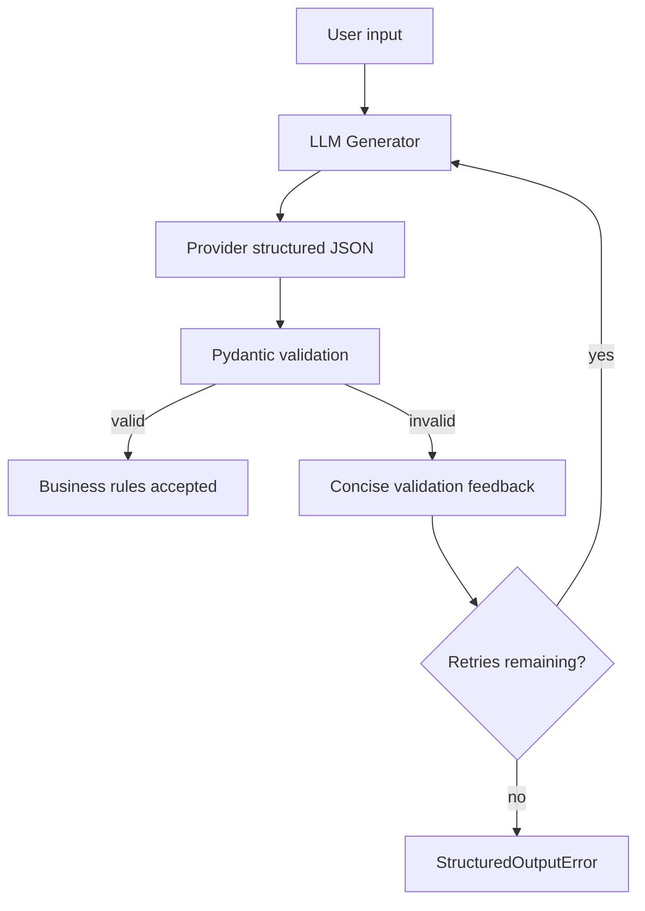

# Architecture

## Pipeline



## Responsibilities

```text
models.py    Customer contract and deterministic business rules
schema.py    Provider JSON Schema derived from Customer
 generator.py OpenAI provider call only
validator.py JSON parsing and Pydantic validation only
retry.py     Feedback formatting and retry policy
pipeline.py  Orchestration and safety boundary
main.py      Human-facing demonstration
```

The intentional boundaries are:

```text
Context != Generation != Validation != Retry != Business Logic
```

## Contract relationship

```text
JSON Schema
     |
     v
Provider output contract
     |
     v
Pydantic Customer model
     |
     v
Validated application object
```

The schema is derived from the Pydantic model to reduce schema drift. `extra="forbid"` rejects fields outside the contract.

## Validation layers

1. Provider-native structured output constrains the model response format.
2. `model_validate_json()` parses JSON and checks field types, required fields, email format, literals, and extra fields.
3. Field validators apply application business rules such as the reasonable age range.

Provider enforcement is useful, but model output is still treated as untrusted at the application boundary.

## Recovery

The pipeline performs one initial generation plus at most `MAX_RETRIES` retries. On validation failure, it creates a short feedback message containing field locations and Pydantic messages. When all attempts fail, it raises `StructuredOutputError` rather than creating a partial or guessed customer.

This project is a Week 6 reliability primitive. Week 7 can add context budgeting, compaction, and few-shot selection around the prompt while leaving generation, validation, retry, and business rules independent.
