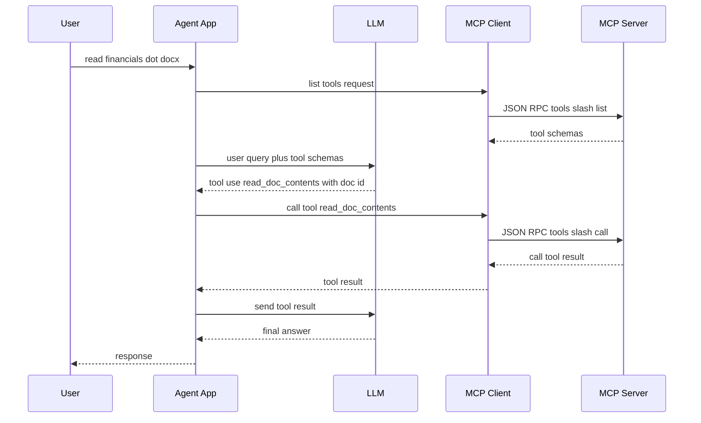

# MCP Advanced Notes (Week 3 Closure Pack)

This file now covers all 6 required outputs for Week 3 and includes a closure check at the end.

## 1) MCP Architecture + JSON-RPC Flow (Real Tool Call Example)

Real example from your project: `read_doc_contents` in `mcp_server.py`.



JSON-RPC request shape (tool call):

```json
{
	"jsonrpc": "2.0",
	"id": 12,
	"method": "tools/call",
	"params": {
		"name": "read_doc_contents",
		"arguments": {"doc_id": "financials.docx"}
	}
}
```

JSON-RPC success response shape:

```json
{
	"jsonrpc": "2.0",
	"id": 12,
	"result": {
		"content": [{"type": "text", "text": "These financials outline..."}]
	}
}
```

Key message types you should remember:
- Request/Result pairs: initialize, tools/list, tools/call
- Notifications: initialized, progress, logging
- Errors: invalid params, tool failure, internal failure

## 2) Decision Table: Tools vs Resources vs Prompts

| Primitive | Use When | Input/Output Style | Side Effects | Example From Your Repo |
|---|---|---|---|---|
| Tool | You need to perform an action | Structured args -> structured result | Allowed | `read_doc_contents`, `edit_doc_contents` |
| Resource | You need retrievable context/data | URI read -> content | None (read-oriented) | `docs://documents`, `docs://document/{doc_id}` |
| Prompt | You need reusable instruction templates | Prompt args -> message template | None directly | `/format report.pdf` workflow |

Fast rule:
- Do something -> Tool
- Read context -> Resource
- Guide model behavior -> Prompt

## 3) Reusable Python MCP Server Template (With Extension Points)

```python
from mcp.server.fastmcp import FastMCP
from pydantic import BaseModel, Field

mcp = FastMCP("ReusableMCP", log_level="INFO")


class SearchArgs(BaseModel):
		query: str = Field(..., min_length=1, description="Search text")
		limit: int = Field(default=5, ge=1, le=50)


# Extension point 1: replace with DB/API/service implementation
def search_backend(query: str, limit: int) -> list[str]:
		return [f"result-{i}: {query}" for i in range(1, limit + 1)]


@mcp.tool(name="search_items", description="Search items by query")
def search_items(query: str, limit: int = 5) -> dict:
		args = SearchArgs(query=query, limit=limit)
		items = search_backend(args.query, args.limit)
		return {"items": items, "count": len(items)}


@mcp.resource("app://health", mime_type="application/json")
def health() -> dict:
		# Extension point 2: add dependency checks and version metadata
		return {"status": "ok", "service": "ReusableMCP"}


@mcp.prompt(name="triage_issue", description="Standard issue triage prompt")
def triage_issue(issue: str) -> str:
		# Extension point 3: evolve prompt policy/versioning
		return (
				"Analyze this issue and return: root cause, impact, and next 3 actions. "
				f"Issue: {issue}"
		)


if __name__ == "__main__":
		# Extension point 4: switch to streamable-http in deployment scenario
		mcp.run(transport="stdio")
```

Template design notes:
- Keep tool inputs validated with Pydantic models.
- Keep outputs predictable and machine-readable.
- Keep resources read-only and deterministic.
- Keep prompts versionable and named clearly.

## 4) Transport Comparison: stdio vs HTTP (Local + Production)

| Aspect | stdio | streamable HTTP |
|---|---|---|
| Best for | Local dev, same-machine integration | Remote hosting, team/shared service |
| Connectivity | Process stdin/stdout | Network HTTP (+ SSE behavior) |
| Server-to-client messaging | Natural bidirectional | Requires streaming/session strategy |
| Setup complexity | Low | Medium to high |
| Horizontal scaling | Limited | Better fit with load balancers |
| Observability/ops | Basic | Stronger infra-level controls possible |
| Typical risk | Hard to distribute remotely | Misconfig can break sampling/progress/logging |

Production guidance:
- Start local with stdio.
- Move to streamable HTTP when you need remote access, central ops, and scaling.
- Use the same transport in testing as planned production transport to avoid late surprises.

## 5) Review of Current MCP Server Design: Security + Reliability Gaps

Findings from your current `Mcp-Project-1` code:

1. Tool/resource error handling returns `ValueError(...)` objects instead of raising or structured MCP errors.
2. Prompt text references `edit_document` while registered tool name is `edit_doc_contents` (tool-name mismatch risk).
3. No authn/authz model for tool execution (fine for local learning, not fine for shared deployment).
4. In-memory docs store has no persistence, concurrency control, or audit trail for edits.
5. No input limits (size/rate) for potentially large payloads.
6. No timeout/retry/circuit-breaker policy documented for external dependencies.
7. Logging is minimal; no correlation IDs for tracing a request across client/server/tool paths.
8. No explicit root/path enforcement pattern for file-access style tools (important for future filesystem tools).

Practical hardening checklist:
- Validate all tool inputs with strict schemas and constraints.
- Raise explicit errors and map to consistent JSON-RPC error structure.
- Add structured logs (request_id, tool_name, duration, status).
- Add timeouts and bounded retries where outbound calls exist.
- Add auth and permission model before HTTP deployment.
- Add rate/size limits and safe defaults.
- Add root-based path allowlisting for file tools.
- Add tests for success path + error path + malformed input.

## 6) Sampling, Notifications, and Roots (Practical Examples)

### Sampling
**What is it?**
- In normal MCP flow, the Client asks the Server to run a tool (`Client -> Server`).
- **Sampling flips this direction:** During tool execution, the **Server asks the Client** to run a sub-prompt through an LLM and return the result (`Server -> Client -> LLM -> Client -> Server`).

**Why the Server asking the Client for an LLM call matters (4 Key Reasons):**
1. **No API Key Leakage (Security):** The MCP server does not need to store, manage, or pay for its own LLM API keys. It safely uses the Client's existing LLM connection.
2. **User Consent & Safety Control:** The Client stays in charge. It can review, audit, rate-limit, or ask the human user for approval before running any LLM call requested by a server.
3. **Model Independence:** The server logic is decoupled from specific LLM providers (e.g. OpenAI vs Anthropic vs local models). The Client chooses which model handles the request.
4. **Agentic Server Tools:** Allows an MCP tool to perform smart inner operations (like summarizing data, classifying input, or generating text) without needing heavy AI SDKs or credentials inside the server itself.

**Flow:**
- `User -> Client -> calls Server Tool`
- `Server Tool needs AI reasoning -> Server sends Sampling Request to Client`
- `Client calls LLM -> Client returns LLM output to Server`
- `Server finishes tool processing -> Server returns final output to Client`

**Practical example:**
- In your `sampling` practice (`Foundation-Week-3/Mcp-Project-1/sampling/`): The server's `summarize()` tool receives text, calls `ctx.session.create_message()` to request a summary from the Client's LLM, and returns the generated text.

### Notifications (Logging + Progress)
Definition:
- One-way updates that do not require a response.

When to use:
- Long-running tool steps where user needs visibility.

Practical example:
- In `Log-Notification` practice: tool emits progress updates (e.g., step 1/4, 2/4) and log lines so the UI does not look stuck.

### Roots
Definition:
- Explicit user-granted filesystem boundaries.

When to use:
- Any tool that reads/writes files or directories.

Practical example:
- In `Root` practice: list allowed roots, resolve user filename inside roots, and reject paths outside allowed directories.

Important caveat:
- SDK does not auto-enforce path safety for your business logic. You must check paths manually.

## Week 3 Artifact Status Check

Required notes/artifacts:

- [ ] MCP architecture diagram (your understanding, hand-drawn)
	- Status: still pending in a hand-drawn form (digital diagrams exist, but hand-drawn is not verified).
- [x] When to use: Tools vs Resources vs Prompts (decision guide)
	- Status: now covered in this file.
- [x] MCP server template (Python, reusable for new servers)
	- Status: now covered in this file.
- [x] stdio vs HTTP transport decision guide
	- Status: now covered in this file.
- [x] Security checklist for MCP servers
	- Status: now covered in this file.

## Week 3 Done-When Validation

- [x] Can draw MCP architecture from memory
	- Done.
- [x] Understand JSON-RPC message flow
	- Yes, clearly demonstrated.
- [x] Know Tools vs Resources vs Prompts distinction
	- Yes, now explicit with decision table.
- [x] Understand sampling and notifications
	- Yes, with practical notes and examples.
- [ ] Completed all Anthropic MCP course videos listed for this week
	- Done. Certificate also done
- [x] Produced all 5 notes/artifacts in your own words
	- Yes after this update, except hand-drawn requirement if strictly mandatory.

Final closure note:
- To fully close Week 3 with zero ambiguity, complete/attach the hand-drawn architecture and confirm course video completion.
