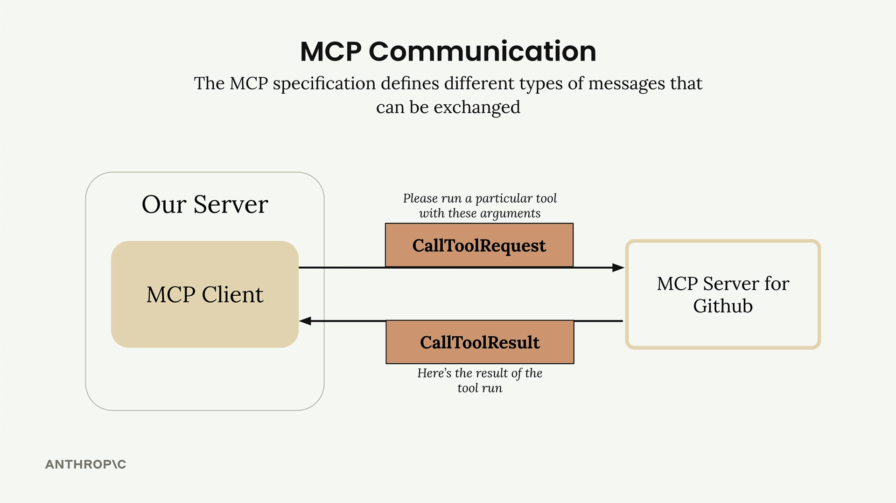
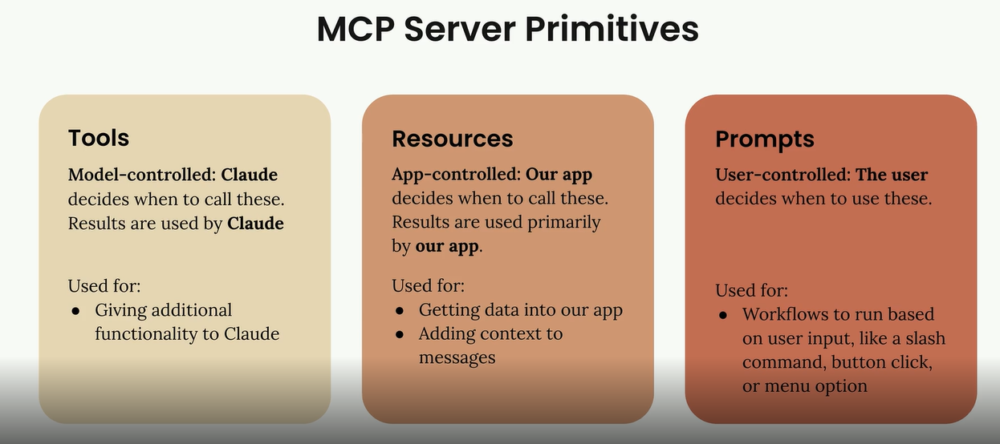
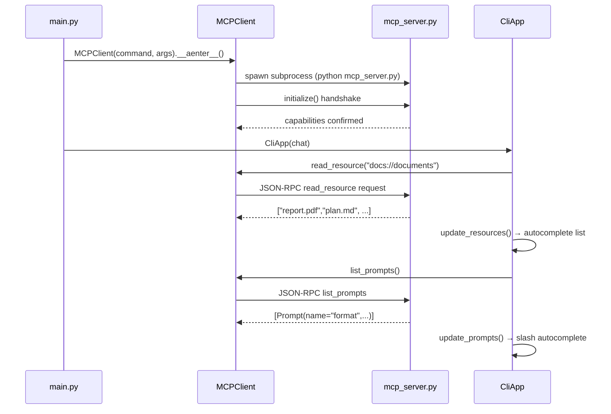
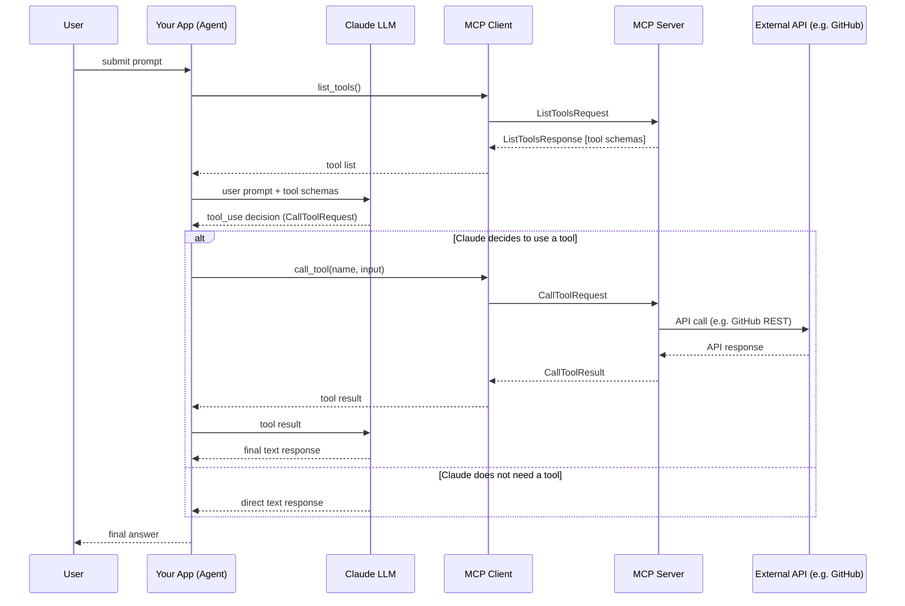
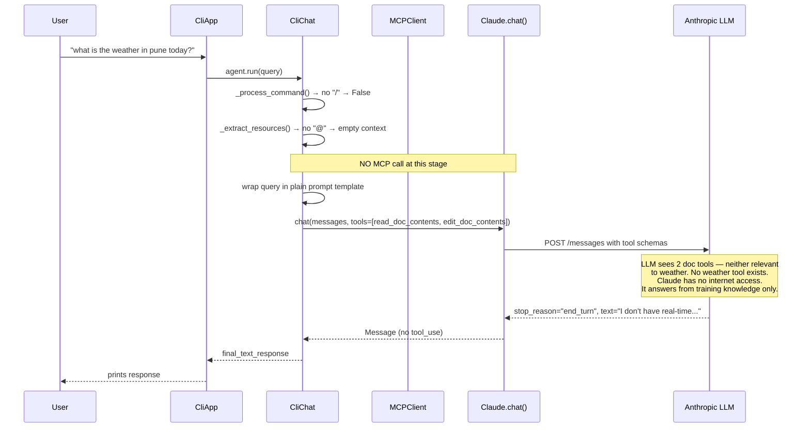
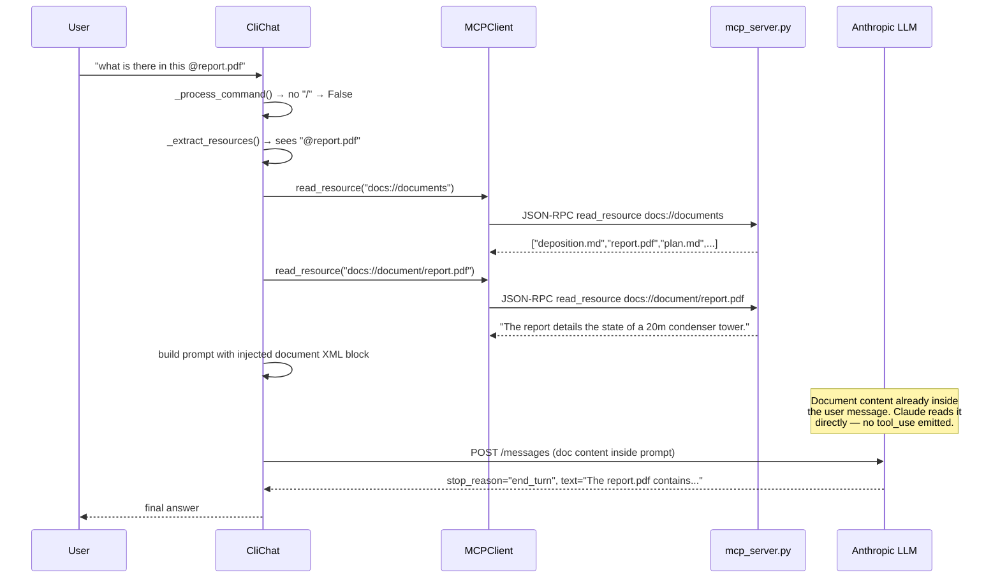
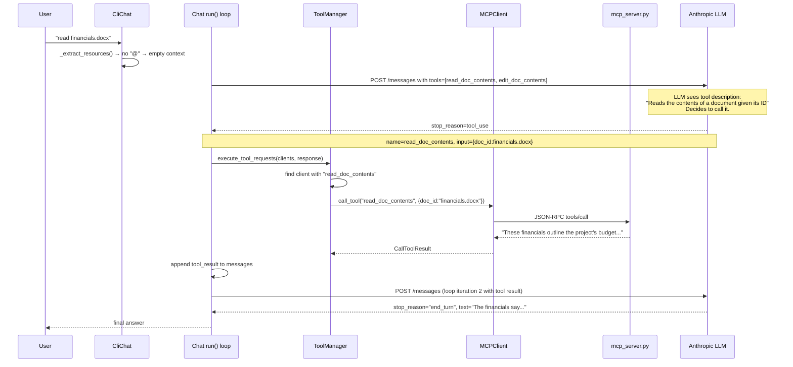
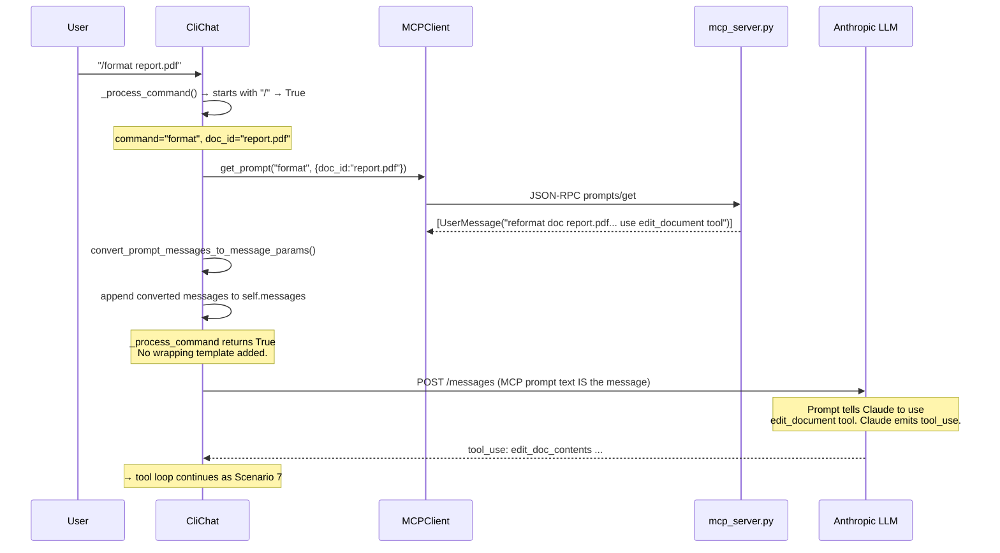
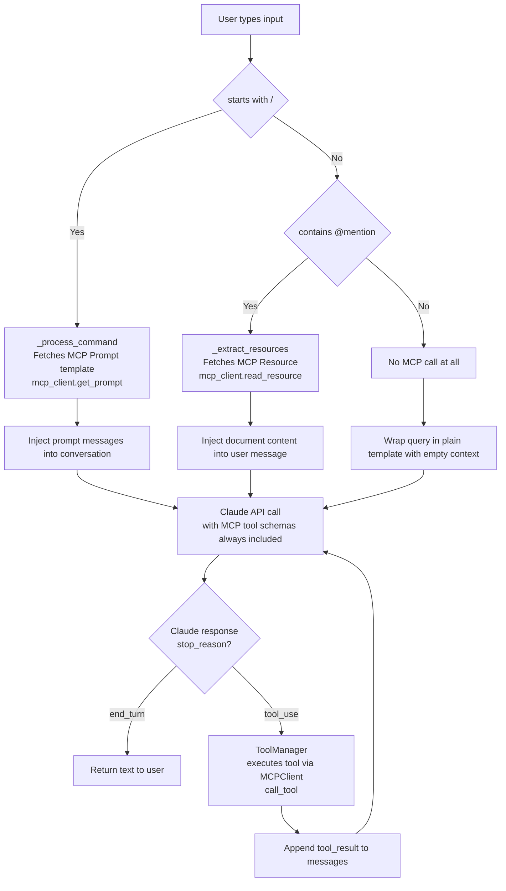
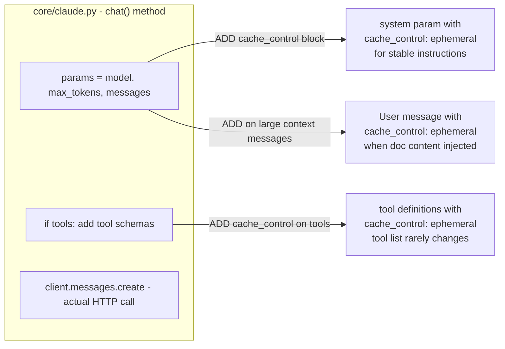

# MCP + LLM Agent — Architecture & Workflow Reference

---

## 1. Flow / Communication Steps (MCP Client–Server)

1. **User** submits prompt to server
2. **Tool Discovery** — Server needs to know what tools are available to send to LLM
3. **List Tools** — Server asks MCP client for the list of available tools
4. **MCP Communication** — MCP client sends `ListToolsRequest` to MCP server and receives `ListToolsResponse`
5. **LLM (Claude) Request** — Server sends (user prompt + available tools) to Claude
6. **Tool Use Decision Making** — Claude/LLM decides, depending on user query, whether it needs to call an MCP tool or not
7. **Tool Execution Request** — Based on above decision, server may ask MCP client to run the required tool (decided by Claude)
8. **External API Call** — MCP client sends `CallToolRequest` to MCP server, which makes further API call to actual external provider (e.g. GitHub API)
9. **Result Flow Back** — GitHub responds with repository data, which flows back through MCP server as `CallToolResult`
10. **Tool Result to Claude** — Server sends tool result back to Claude
11. **Final Response** — Claude formulates final response using MCP tool data + LLM knowledge
12. **User gets answer** — Server delivers response back to user

---

**MCP Tool Communication diagram:**


**MCP Server Primitives:**





## 2. System Architecture

```mermaid
graph TB
    subgraph YourProcess["Your Python Process (main.py)"]
        CLI["CliApp<br/>core/cli.py<br/>PromptSession REPL"]
        CHAT["CliChat<br/>core/cli_chat.py<br/>_process_query()"]
        CHATBASE["Chat<br/>core/chat.py<br/>run() loop"]
        CLAUDE["Claude<br/>core/claude.py<br/>client.messages.create()"]
        TOOLMGR["ToolManager<br/>core/tools.py<br/>execute_tool_requests()"]
        MCPCLIENT["MCPClient<br/>mcp_client.py<br/>ClientSession"]
    end

    subgraph MCPProcess["Separate OS Process stdio"]
        MCPSERVER["mcp_server.py<br/>FastMCP DocumentMCP<br/>docs in-memory dict"]
    end

    subgraph AnthropicAPI["Anthropic Cloud API"]
        LLM["Claude LLM Model<br/>claude-3-x or claude-4-x"]
    end

    CLI -->|user_input| CHAT
    CHAT -->|inherits| CHATBASE
    CHAT -->|preprocess: @mentions, /commands| MCPCLIENT
    CHATBASE -->|messages + tool_schemas| CLAUDE
    CLAUDE -->|HTTP POST /messages| LLM
    LLM -->|response: text or tool_use| CLAUDE
    CLAUDE -->|Message object| CHATBASE
    CHATBASE -->|if tool_use| TOOLMGR
    TOOLMGR -->|call_tool()| MCPCLIENT
    MCPCLIENT <-->|stdin/stdout JSON-RPC| MCPSERVER
```

---

## 3. Startup Initialization Sequence



---

## 4. MCP Tool Communication (Generic Pattern)



---

## 5. Scenario: Plain Query — "what is the weather in pune today?"



> **Why Claude cannot "just fetch weather":** Claude is a stateless language model. It generates text from training data. It has **no internet access**. The only way it can fetch live data is if your code provides a tool for it (e.g. a `get_weather(city)` MCP tool). Your server only has doc tools, so Claude falls back to training knowledge.

---

## 6. Scenario: Resource Mention — "what is there in this @report.pdf"



> **Key difference vs weather:** The app itself (not Claude) makes the MCP resource call and injects content before Claude is even asked. Claude just reads what your code prepared.

---

## 7. Scenario: Tool Call — Claude decides to use a tool

Triggered when user asks without `@` prefix, e.g. *"read financials.docx"*



---

## 8. Scenario: Slash Command (Prompt Workflow) — "/format report.pdf"



---

## 9. Decision Tree: Does MCP get called?



---

## 10. Quick Reference: MCP Feature vs Code Path

| User Input Pattern | Who makes MCP call | When | MCP Feature Used | Code Location |
|---|---|---|---|---|
| `@doc` mention | App code (preemptive) | Before Claude | Resource (`read_resource`) | `cli_chat.py _extract_resources()` |
| `/command doc` | App code (preemptive) | Before Claude | Prompt template (`get_prompt`) | `cli_chat.py _process_command()` |
| Plain query | Nobody preemptive | — | Nothing | — |
| Claude needs data | Claude decides | During tool loop | Tool call (`call_tool`) | `tools.py execute_tool_requests()` |
| Startup init | App code | Once at boot | Resource + Prompt list | `cli.py initialize()` |

---

## 11. Where Prompt Caching Would Be Added



**The only file that touches the Anthropic API is `core/claude.py` at `client.messages.create(**params)`.  
Everything else in the codebase feeds data into `params` before that single call.**
