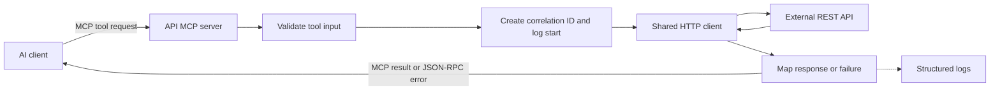
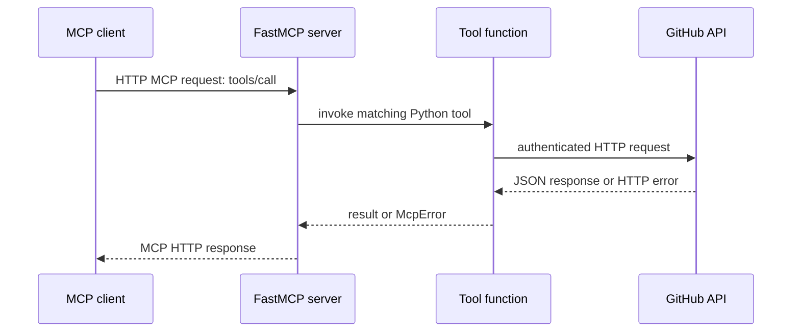
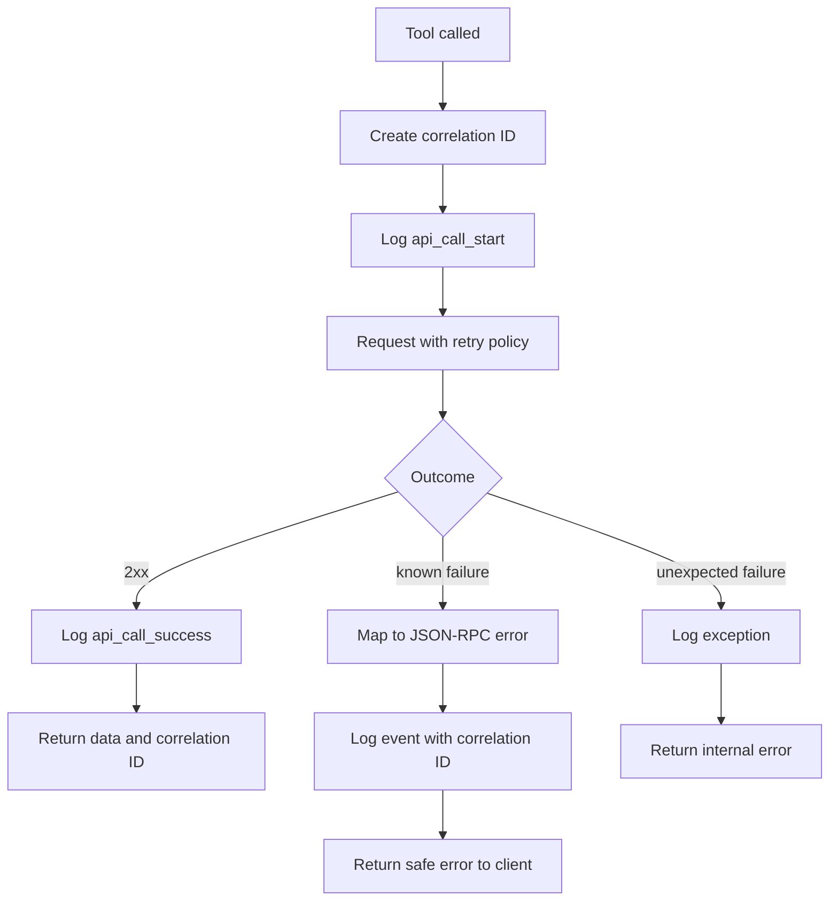

# Day 1: API MCP and HTTP Revision

## Goal

Build an MCP server that gives an AI client a small, reliable, observable interface to a real REST API, such as GitHub, Azure DevOps, or SonarQube.

The MCP server is an adapter: it receives an MCP tool request, validates it, makes an HTTP request to the external API, then returns a predictable MCP response.

## The Big Idea

An LLM should call named tools such as `get_repository` or `list_pull_requests`, not construct arbitrary HTTP requests. Each tool defines the permitted operation and lets the server enforce reliability and security rules in one place.



## Day 1 Schedule: 2 Hours 30 Minutes

### Block 1: Understand one API tool (40 minutes)

1. Open [api_connector_mcp_server.py](../templates/api_connector_mcp_server.py).
2. Start with `get_repository(owner, repo)`.
3. Trace it to `_safe_api_call`, then `_request_with_retry`.
4. Identify the actual external API URL, method, path, headers, timeout, and result.

**Checkpoint:** You can say where the GitHub URL is configured and why the tool does not use `requests.get()` directly.

### Block 2: Input validation and authentication (25 minutes)

1. Read `ResourcePath` and its validator.
2. Try to explain why a path beginning with `/` or containing `..` is rejected.
3. Inspect `_build_headers` and set `GITHUB_TOKEN` through `.env` or the environment.
4. Confirm the token is never returned in an MCP response or log message.

### Block 3: Reliability patterns (35 minutes)

1. Read the `httpx.Client` configuration.
2. Follow what happens on a timeout, network failure, HTTP 404, HTTP 500, and rate limit.
3. Read the `@retry` configuration and identify its stop rule and exponential wait rule.

**Checkpoint:** You can explain why retrying a 401 authorization error is usually pointless, while retrying a temporary 500 can be useful.

### Block 4: Errors, logs, and transport (30 minutes)

1. Read `ErrorCode`, `_map_known_error`, and `_jsonrpc_error`.
2. Locate where the correlation ID is made and where it is returned.
3. Read `health_check` and the `mcp.run(transport="streamable-http")` entry point.
4. Compare a useful public error with a detailed internal log entry.

### Block 5: Test failure paths and recap (20 minutes)

Predict the outcome before testing:

| Situation | Server behavior |
|---|---|
| invalid pull-request state | return `-32602` invalid params |
| non-positive pull-request number | return `-32602` invalid params |
| external API timeout | retry, then return external API error |
| GitHub 404 | return resource-not-found error |
| GitHub rate limit exhausted | return rate-limited error with retry information |
| unexpected exception | log full exception, return generic internal error |

## How the Template Works

### 1. Configuration and secrets

`Settings(BaseSettings)` reads configuration from the environment.

```env
API_BASE_URL=https://api.github.com
GITHUB_TOKEN=replace_with_your_token
API_TIMEOUT_SECONDS=20
MAX_RETRIES=3
```

Keep real tokens in `.env` only for local development, exclude `.env` from Git, and use a secret manager in deployment. The default token is an empty string so public endpoints can still work without one, but authenticated access gives a higher rate limit.

### 2. MCP tools are the public contract

The `@mcp.tool` decorator makes a Python function discoverable and callable by an MCP client.

| Tool | HTTP request it represents |
|---|---|
| `get_repository` | `GET /repos/{owner}/{repo}` |
| `list_pull_requests` | `GET /repos/{owner}/{repo}/pulls` |
| `get_pull_request` | `GET /repos/{owner}/{repo}/pulls/{number}` |
| `list_issues` | `GET /repos/{owner}/{repo}/issues` |
| `rate_limit_status` | `GET /rate_limit` |

This is a deliberately narrow API surface. It gives the client useful capabilities without allowing it to call every possible remote endpoint.

### 3. Streamable HTTP transport

MCP needs a transport to move messages between client and server. The template starts FastMCP with `streamable-http`.



`streamable-http` supports MCP over HTTP and can support server-to-client events where the deployment and client require them. For a local command-line MCP connection, `stdio` is another transport, but this Day 1 template is intentionally designed around HTTP deployment.

### 4. One shared HTTP client

`httpx.Client` is created once and reused.

```python
http_client = httpx.Client(
    base_url=settings.api_base_url,
    timeout=httpx.Timeout(settings.api_timeout_seconds),
    limits=httpx.Limits(max_connections=100, max_keepalive_connections=20),
    headers=_build_headers(),
)
```

Benefits:

- Connection reuse is faster than creating a new TCP/TLS connection for every tool call.
- A timeout prevents one slow API from blocking the server forever.
- Connection limits stop unbounded concurrent outbound connections.
- Default headers keep authentication and API versioning consistent.

### 5. Request flow and correlation IDs

Every `_safe_api_call` creates a UUID correlation ID.



The same ID appears in logs and client output. When someone reports a failure, search logs for that ID instead of guessing which request they mean.

### 6. Retry and exponential backoff

The template retries timeout, temporary server, and rate-limit failures. Its delay grows exponentially up to a limit.

For a simple exponential pattern, the waits are approximately $1, 2, 4, 8$ seconds, capped by the configured maximum. This avoids instantly retrying many times when the upstream service is already overloaded.

Only retry failures that may be temporary. Do not retry bad input (4xx client error), an invalid token, or a not-found response; the same request will likely fail again.

### 7. Rate limits

An external API often limits how many requests an identity may make in a time window. GitHub returns rate-limit headers, including remaining requests and a reset time.

When `x-ratelimit-remaining` is `0`, the template raises `APIRateLimitError` and calculates a possible retry delay from `x-ratelimit-reset`.

**Remember:** rate limiting is a contract with the external API. Checking the remaining quota and returning a clear error protects both the upstream service and your MCP server.

### 8. Error taxonomy

The client needs predictable errors. The implementation maps low-level exceptions to JSON-RPC error codes.

| Condition | Code | Client action |
|---|---:|---|
| bad tool argument | `-32602` | correct input |
| token invalid or permission denied | `-32002` | check token and scopes |
| resource absent | `-32003` | use a valid owner/repo/item |
| timeout, rate limit, or API 5xx | `-32001` or `-32004` | wait/retry later or inspect upstream service |
| unexpected server failure | `-32603` | contact/investigate server |

`McpError(ErrorData(...))` is how the server returns a protocol-level error rather than pretending a failed API call was normal data.

### 9. Structured logging

Logs should be useful to an operator, not a copy of every response body. Record:

- event name, for example `api_call_start` or `api_timeout`
- correlation ID
- HTTP method and safe request path
- response status or exception category
- duration, where available

Never log the GitHub token, `Authorization` header, or sensitive response fields. Correlation IDs let you trace requests without exposing secrets.

### 10. Health resource

`@mcp.resource("health://status")` exposes a lightweight MCP resource returning service state, configured transport, and a timestamp. A health check should be quick and should not trigger a costly external API call unless dependency health is specifically required.

## Key Terms to Remember

| Term | Remember this |
|---|---|
| REST API | HTTP interface based on resources, methods, URLs, headers, and JSON. |
| MCP tool | Typed server capability that an AI client can discover and invoke. |
| Streamable HTTP | MCP transport that carries protocol messages over HTTP. |
| HTTP client | Reusable object that sends requests to an external service. |
| Timeout | Maximum time to wait before treating an operation as failed. |
| Retry | Repeat a possibly temporary failed operation using a bounded policy. |
| Exponential backoff | Increase the wait between retries to reduce pressure on a failing service. |
| Rate limit | Maximum number of API requests allowed during a time window. |
| Correlation ID | Unique ID used to trace one request through logs and responses. |
| Error taxonomy | Consistent categories and codes for failures. |
| Least privilege | Token has only the scopes it needs. |

## Build and Security Checklist

- [ ] Define a small set of named MCP tools.
- [ ] Validate every tool parameter and bound pagination values.
- [ ] Reject unsafe resource paths such as absolute paths and `..` traversal.
- [ ] Load base URLs and tokens through settings/environment variables.
- [ ] Reuse one HTTP client with connection limits and a timeout.
- [ ] Retry only temporary failures, with a maximum attempt count and backoff.
- [ ] Detect and report rate limiting.
- [ ] Map failures to meaningful JSON-RPC errors.
- [ ] Log correlation IDs but never log secrets.
- [ ] Provide a lightweight health resource.

## Final Self-Check

1. Why do we expose `get_repository` instead of a general "call any URL" tool?
2. What two problems does a shared `httpx.Client` solve?
3. Which failures should you retry, and which should you return immediately?
4. What value does a correlation ID add when debugging a user report?
5. Why is an API token configuration, not code?

**One-sentence summary:** A production API MCP server wraps a small external API surface with validated inputs, secret-safe configuration, bounded retries, clear errors, and traceable logs.