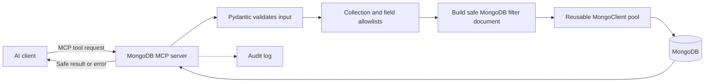
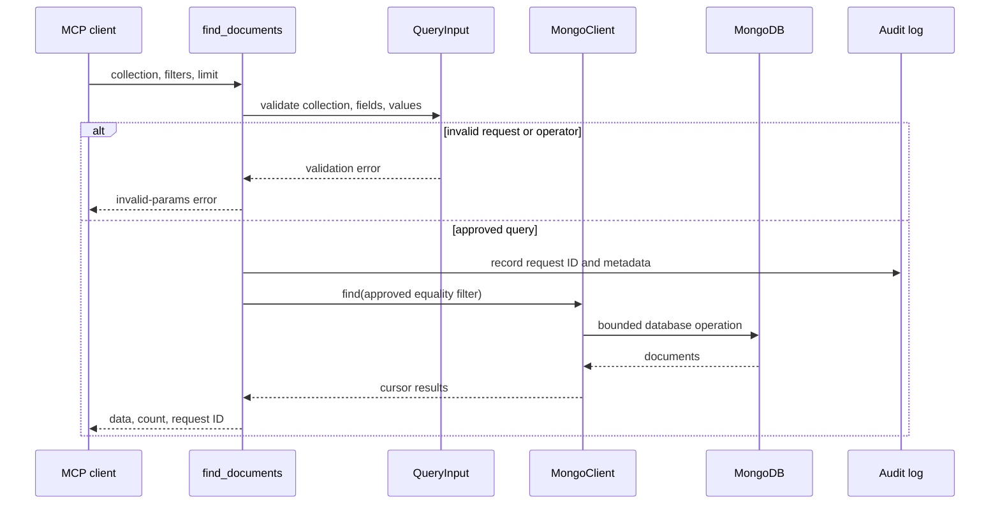
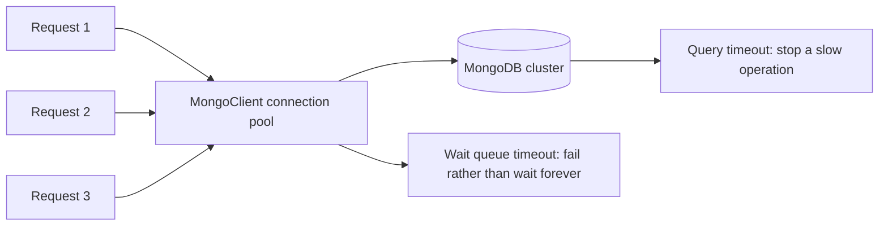
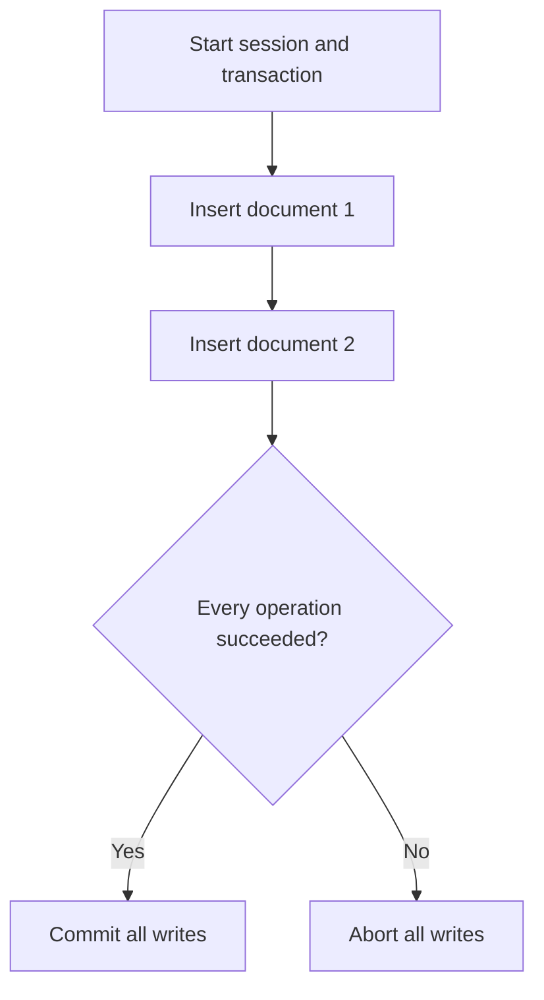
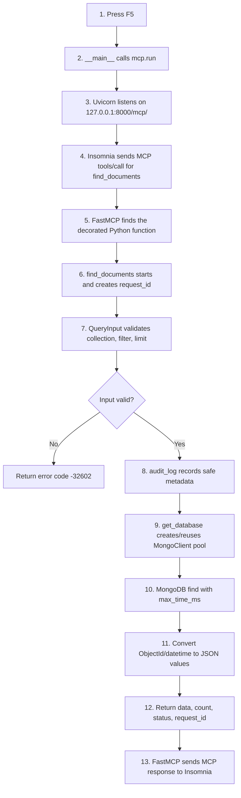

# Day 2: MongoDB MCP and Security Revision

## Goal

Build an MCP server that lets an AI client find and insert approved MongoDB documents without giving it unrestricted database commands.

MongoDB is a document database. Instead of SQL tables and rows, it stores JSON-like documents in collections. For example, a `users` collection can contain documents such as `{"name": "Ada", "email": "ada@example.com", "status": "active"}`.

The MCP server is the security boundary. It decides which collections, fields, operations, and query shapes are permitted.



## The Important Change from SQL

In SQL, safety means using parameterized queries, where SQL structure and values are sent separately.

In MongoDB, you send a Python dictionary as the filter. There is no SQL string to concatenate. However, the filter dictionary itself can contain powerful MongoDB operators, including `$ne`, `$where`, and `$expr`.

Therefore, this Day 2 server uses a stricter rule:

1. Do not accept arbitrary MongoDB query documents from the client.
2. Allow only known collections, including the configured `Test` collection.
3. Allow only known fields for each collection.
4. Allow simple equality values only.
5. Reject keys beginning with `$` and dotted field paths.

Safe request:

```python
find_documents(collection="Test", filters={"City": "Addison"}, limit=10)
```

Rejected request:

```python
find_documents(collection="Test", filters={"$where": "this.password != null"})
```

## Day 2 Detailed Schedule: 2 Hours 50 Minutes

### Block 1 (90 min): Build the MongoDB MCP Server

Use [mongodb_connector_mcp_server.py](../templates/mongodb_connector_mcp_server.py).

**What to build**

- An MCP server with tools for safe MongoDB document reads and writes.
- Query-injection prevention by validating the document filter shape.
- A reusable `MongoClient` with a connection pool.

**Follow this sequence**

1. Install the dependencies from [requirements.txt](../templates/requirements.txt).
2. Start MongoDB locally or use an Atlas connection string.
3. Copy [mongodb_connector.env.example](../templates/mongodb_connector.env.example) to `.env` in the working directory and set `MONGODB_URI`.
4. Read `Settings`. It loads database configuration from environment variables rather than source code.
5. Read `ALLOWED_FIELDS`. This is the policy list for collections and fields.
6. Call `find_documents` with `collection="Test"`, `filters={"City": "Addison"}`, and `limit=10`.
7. Follow the code path: tool input -> `QueryInput` -> allowlist checks -> `collection.find()` -> returned documents.

**Production patterns implemented**

| Requirement | MongoDB implementation |
|---|---|
| Parameterization / no string concatenation | Use typed Python dictionaries, never construct query code as strings. |
| Input validation | Pydantic validates collection name, fields, values, and limit before a query runs. |
| Connection pooling | One `MongoClient` is created for the server lifetime; PyMongo manages its pool. |
| Secrets management | URI and database name come from environment variables. |
| Query timeouts | `max_time_ms` bounds each find operation; driver timeouts bound connection and socket waits. |

**Definition of done**

- `find_documents` accepts only approved collections, fields, values, and limits.
- MongoDB operators and dotted field paths are rejected before reaching the driver.
- The client is configured once with pool limits and timeouts.
- Credentials come from `MONGODB_URI`, never Python code.
- Each database operation has a query time limit.

### Block 2 (60 min): Validation, Audit Logging, Access Control, Transactions

**What to add and understand**

1. **Query allowlist:** `ALLOWED_FIELDS` defines allowed fields separately for each collection.
2. **Audit logging:** `audit_log` records request ID, actor, operation, collection, and safe metadata. It does not log document values or secrets.
3. **Read/write separation:** `find_documents` is a read tool. `insert_document` and `insert_documents_transaction` are separate write tools.
4. **Access control:** `WRITES_ENABLED=false` is the default. In production, use upstream authenticated identity plus MongoDB roles. A caller-provided `actor` label is for auditing only and is not authentication.
5. **Transactions:** `insert_documents_transaction` inserts a list of documents atomically.



MongoDB transactions require a replica set or sharded cluster. A standalone local MongoDB instance cannot run multi-document transactions. For early learning, test the single-document write tool first.

### Consolidation (20 min): Security Patterns

Before ending the session, answer these questions without reading the code:

1. Why is a MongoDB filter dictionary not automatically safe just because it is not SQL?
2. Which validation prevents `$where` from reaching the database?
3. Why does this server create one `MongoClient` instead of one client per tool call?
4. Why are write tools separate and disabled by default?
5. When can MongoDB roll back several writes together?

## How the MongoDB Template Works

### 1. Settings and secrets

The `.env` values are configuration, not source code:

```env
MONGODB_URI=mongodb://localhost:27017
MONGODB_DATABASE=mcp_learning
MONGO_MAX_POOL_SIZE=10
MONGO_QUERY_TIMEOUT_MS=5000
WRITES_ENABLED=false
```

For MongoDB Atlas, `MONGODB_URI` includes the username, password, and cluster hostname. Do not commit this file. Commit only the provided example file.

### 2. Connection pooling and timeouts

`MongoClient` is safe to share across requests. PyMongo creates and reuses connections internally.



The template defaults assume one low-concurrency learning server:

- `MONGO_MAX_POOL_SIZE=10`: at most 10 normal pooled connections.
- `MONGO_MIN_POOL_SIZE=0`: do not keep idle connections warm while learning locally.
- `MONGO_WAIT_QUEUE_TIMEOUT_MS=5000`: a busy pool fails after 5 seconds rather than waiting forever.
- `MONGO_SERVER_SELECTION_TIMEOUT_MS=5000`: stop trying to find an available MongoDB server after 5 seconds.
- `MONGO_CONNECT_TIMEOUT_MS=5000`: bound initial network connection setup.
- `MONGO_SOCKET_TIMEOUT_MS=30000`: bound network reads and writes.
- `MONGO_QUERY_TIMEOUT_MS=5000`: ask MongoDB to stop a slow `find` operation after 5 seconds.

These are starting values, not universal production numbers. Pool size depends on deployment type, expected concurrency, number of app instances, and MongoDB cluster capacity. Measure before increasing it.

### 3. Input validation template

`QueryInput` validates a read request. `InsertInput` validates a document before it is written.

```python
class QueryInput(BaseModel):
    collection: Literal["users", "orders", "products", "Test"]
    filters: dict[str, Scalar] | None = None
    limit: int = Field(default=100, ge=1, le=1_000)
```

Then two checks protect the filter:

- `field.startswith("$")` rejects MongoDB operators such as `$where`.
- `set(filters) - ALLOWED_FIELDS[collection]` rejects fields that are not approved for that collection.

The template accepts equality filters only. Do not add `$regex`, `$in`, range filters, sorting, aggregation, or raw pipelines until each capability has a precise schema and policy.

For approved writes, `Test` also supports JSON-compatible arrays and objects, including `Capabilities`, `BusinessFunctions`, `BusinessLines`, `MailingAddress`, and `Location`. Their nested keys are checked recursively: keys beginning with `$` or containing `.` are rejected. MongoDB `_id` is generated by the database and is returned by reads as a JSON-safe string.

### 4. Read/write separation and roles

Use separate MongoDB credentials where possible:

| Server type | Suggested MongoDB role |
|---|---|
| read-only MCP | `read` on only its needed database |
| write-enabled MCP | minimal custom role, or narrowly scoped `readWrite` for learning |
| administration tool | separate administrator identity; never expose it through a general MCP tool |

`WRITES_ENABLED` is an additional safety switch, not a replacement for authentication and database roles.

### 5. Transaction boundary



Use a transaction when several writes must either all succeed or all fail. A single `insert_one` operation is already atomic for that one document.

### 6. Errors and health checks

| Situation | Code | Meaning |
|---|---:|---|
| invalid collection, field, operator, or limit | `-32602` | correct the tool arguments |
| write is disabled | `-32002` | this server is not permitted to write |
| pool busy, database unavailable, or query fails | `-32004` | retry later or inspect service logs |
| unexpected server bug | `-32603` | investigate the server |

The health resource runs MongoDB `ping`, which checks connectivity without reading application documents.

## Complete Code Walkthrough

Read [mongodb_connector_mcp_server.py](../templates/mongodb_connector_mcp_server.py) from top to bottom in this order.

### 1. Imports and constants

The imports bring in four jobs:

- `FastMCP`: declares MCP tools/resources and starts the HTTP server.
- `BaseModel`, `Field`, and validators: Pydantic input validation.
- `MongoClient`: talks to MongoDB and manages its connection pool.
- `ObjectId`: MongoDB's default `_id` type, converted to a string before returning JSON.

`CollectionName` restricts collection names. `ALLOWED_FIELDS` is the central permission policy. `MAX_DOCUMENT_NESTING` and `MAX_ARRAY_ITEMS` stop oversized or deeply nested write payloads.

### 2. `Settings`: configuration class

`Settings(BaseSettings)` loads configuration when `settings = Settings()` runs.

`BaseSettings` looks first for environment variables and also reads `.env`. For example, `MONGODB_URI` becomes `settings.mongodb_uri` and `MONGO_QUERY_TIMEOUT_MS` becomes `settings.mongo_query_timeout_ms`.

`Field(default=10, ge=1, le=100)` means: use `10` if no value is set, but reject values below `1` or above `100`. This is validation for configuration, not tool input.

### 3. `get_database()`: lazy database connection

`mongo_client` starts as `None`. The first tool that needs MongoDB calls `get_database()`.

1. It creates `MongoClient` once with pool and timeout settings.
2. PyMongo resolves the Atlas connection and opens connections only when needed.
3. Later tool calls reuse that same client and its pool.
4. It returns the configured database, for example `mcp_learning`.

This lazy design means the debugger can start the web server without waiting for Atlas DNS. Put a breakpoint here to watch the first real database connection.

### 4. `QueryInput(BaseModel)`: read request validation

`QueryInput` is the shape required by `find_documents`:

- `collection` must be one of the values in `CollectionName`.
- `filters` must be a dictionary of simple scalar equality values, or `None`.
- `limit` must be between `1` and `1000`.

Pydantic runs `reject_mongo_operators` first. It rejects filter field names beginning with `$` and any dotted path such as `Location.coordinates`. Then `validate_filter_fields` verifies every remaining field is in `ALLOWED_FIELDS` for that collection.

### 5. `InsertInput(BaseModel)`: write request validation

`InsertInput` validates `insert_document` and every document in `insert_documents_transaction`.

`validate_document_values` calls `_validate_json_document` recursively. It permits normal JSON values: strings, numbers, booleans, `null`, lists, and objects. It rejects unsafe nested keys such as `$where` or `profile.email`, excessive nesting, and huge arrays.

Then `validate_document_fields` validates the top-level document fields against the collection allowlist.

### 6. Supporting helper functions

| Function | Job |
|---|---|
| `_validate_json_document` | Recursively validates nested arrays/objects before writes. |
| `_serialize_document` | Converts `ObjectId` to a string and datetimes to ISO text so an MCP JSON response can carry them. |
| `audit_log` | Records safe request metadata: request ID, actor, operation, collection, and counts. |
| `_validation_error` | Converts invalid input into JSON-RPC `-32602`. |
| `_database_error` | Converts PyMongo failures into JSON-RPC `-32004`. |

### 7. The MCP tools and resource

| Decorated function | Called by | What it does |
|---|---|---|
| `@mcp.tool find_documents` | `tools/call` with name `find_documents` | Validates an equality filter, reads up to `limit` documents, serializes them, and returns them. |
| `@mcp.tool insert_document` | `tools/call` with name `insert_document` | Validates one document and inserts it only when `WRITES_ENABLED=true`. |
| `@mcp.tool insert_documents_transaction` | `tools/call` with name `insert_documents_transaction` | Validates a list, then inserts it in one transaction when MongoDB supports transactions. |
| `@mcp.resource health://status` | `resources/read` | Pings MongoDB and returns `healthy` or `degraded`. |

`actor` is only an audit label in this learning server. A real production system must obtain the user identity from authenticated HTTP middleware or an identity provider, not trust a tool argument.

### 8. `main`: starts the server once

```python
if __name__ == "__main__":
    mcp.run(transport="streamable-http")
```

This code runs only when you start the Python file with F5 or from the terminal. It starts Uvicorn on `127.0.0.1:8000` and exposes MCP at `http://127.0.0.1:8000/mcp/`.

It does **not** run again when Insomnia calls a tool. Each later HTTP request is routed by FastMCP to the decorated tool function. For tool debugging, set breakpoints in `find_documents`, `QueryInput`, `get_database`, or `_serialize_document`.

## End-to-End Tool Call Flow

Use this diagram when testing `find_documents` from Insomnia:



**Breakpoint order for one read request:** `find_documents` -> `QueryInput.validate_filter_fields` -> `audit_log` -> `get_database` -> `_serialize_document`.

## Security Checklist

- [ ] Expose named tools, never a raw `run_any_mongo_command` tool.
- [ ] Allowlist collections and allowed fields per collection.
- [ ] Reject all `$` operator keys and dotted field paths unless a specific policy permits them.
- [ ] Bound document count and query execution time.
- [ ] Create and reuse one `MongoClient` per server process.
- [ ] Store `MONGODB_URI` in environment variables or a secret manager.
- [ ] Use least-privilege MongoDB roles.
- [ ] Keep read and write tools separate; keep writes disabled by default.
- [ ] Log request metadata, not credentials or sensitive document values.
- [ ] Test invalid filters, pool exhaustion, unavailable MongoDB, and disabled writes.

## Key Terms to Remember

| Term | Remember this |
|---|---|
| Document | JSON-like MongoDB record. |
| Collection | Group of documents, similar in purpose to a SQL table. |
| Filter | Dictionary that selects documents, for example `{"status": "active"}`. |
| MongoDB operator | Special query key beginning with `$`, such as `$ne`; powerful and must be controlled. |
| Allowlist | Explicit list of permitted collections, fields, or operations. |
| MongoClient | Long-lived PyMongo client that manages connections and pooling. |
| Query timeout | Maximum permitted time for one database operation. |
| Least privilege | Database identity gets only needed permissions. |
| Transaction | Several writes succeed together or are all rolled back. |
| Audit log | Record of who attempted which operation, when, and with what outcome. |

**One-sentence summary:** A secure MongoDB MCP server exposes small approved tools, validates every filter shape, uses one configured client, limits slow operations, separates writes, and records safe audit metadata.