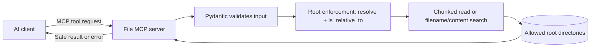

# Day 3: File/RAG MCP and Stateless Pattern Revision

## Goal

Build an MCP server that lets an AI client read and search files under approved root directories only, designed so any number of stateless instances can serve requests behind a load balancer.



## The Important Change from Day 2

Day 2's MongoDB server kept one pooled connection alive for the process lifetime. Day 3 keeps **no state at all** in server memory — every request is self-contained, so `stateless_http=True` lets you run multiple identical instances behind a load balancer with no sticky sessions.

Safe request:

```python
read_file(file_path="notes/plan.md")
```

Rejected request:

```python
read_file(file_path="../../etc/passwd")
```

## Day 3 Detailed Schedule: 2 Hours 50 Minutes

### Block 1 (90 min): Build the File System MCP Server

Use [file_connector_mcp_server.py](../templates/file_connector_mcp_server.py).

**Follow this sequence**

1. Install dependencies from [requirements.txt](../templates/requirements.txt) (same `mcp` + `pydantic-settings` as Day 2; no new package needed).
2. Copy [file_connector.env.example](../templates/file_connector.env.example) to `.env` and set `ALLOWED_ROOTS` to a real folder, e.g. `./data`.
3. Read `resolve_safe_path`. It rejects `..` and absolute paths, then confirms the resolved path is still `is_relative_to` an allowed root.
4. Call `read_file(file_path="sample.txt")` for a file that exists under `ALLOWED_ROOTS`.
5. Call `search_files(query="plan")` to see filename and content matches.

**Production patterns implemented**

| Requirement | File implementation |
|---|---|
| Stateless design | No session state; `resolve_safe_path` and tools depend only on request input and config. |
| Root enforcement | `resolve_safe_path` rejects traversal before any filesystem call. |
| File size limits | `max_file_size_mb` check runs before reading. |
| Streaming reads | `read_file` reads in `chunk_size_bytes` chunks instead of loading in one call. |
| Search indexing | `search_files` does a simple in-memory filename/content scan across allowed roots. |

**Definition of done**

- Tools accept only root-scoped relative paths.
- Path traversal attempts (`../`) are rejected with `-32002` before touching disk.
- Oversized files are rejected with `-32005` before being read.
- Server has no in-memory session state (verified by reading the module — no globals hold request data).

### Block 2 (60 min): Stateless HTTP, Health, Metrics

**What to add and understand**

1. **Stateless HTTP flag:** `FastMCP(..., stateless_http=True)` disables session-dependent features (sampling, progress notifications) so any instance can handle any request.
2. **Health check:** `health://status` reports root accessibility for load balancer probes.
3. **Metrics:** `metrics://stats` reports file count and total storage size.
4. **Graceful shutdown:** the streamable-HTTP transport finishes in-flight requests on exit; no extra code needed since there is no state to flush.

**Testing**

- Run two instances on different ports and confirm both answer `read_file` and `search_files` identically.
- Call `health://status`; it should report `roots_accessible` > 0.
- Attempt `read_file(file_path="../secret.txt")`; confirm it fails with `-32002`.

### Consolidation (20 min): Scaling Patterns

Answer without reading the code:

1. Why does `stateless_http=True` allow horizontal scaling without sticky sessions?
2. Which two checks does `resolve_safe_path` perform before returning a path?
3. Why does `read_file` check file size before reading instead of after?
4. What would happen if `search_files` scanned dotted/absolute paths without validation?

## Errors and Health Checks

| Situation | Code | Meaning |
|---|---:|---|
| invalid file path shape or query | `-32602` | correct the tool arguments |
| path resolves outside `ALLOWED_ROOTS` | `-32002` | traversal or absolute path blocked |
| file does not exist | `-32003` | check the path is correct |
| file exceeds `MAX_FILE_SIZE_MB` | `-32005` | request a smaller file or raise the limit deliberately |
| unexpected read failure | `-32603` | investigate server logs |
